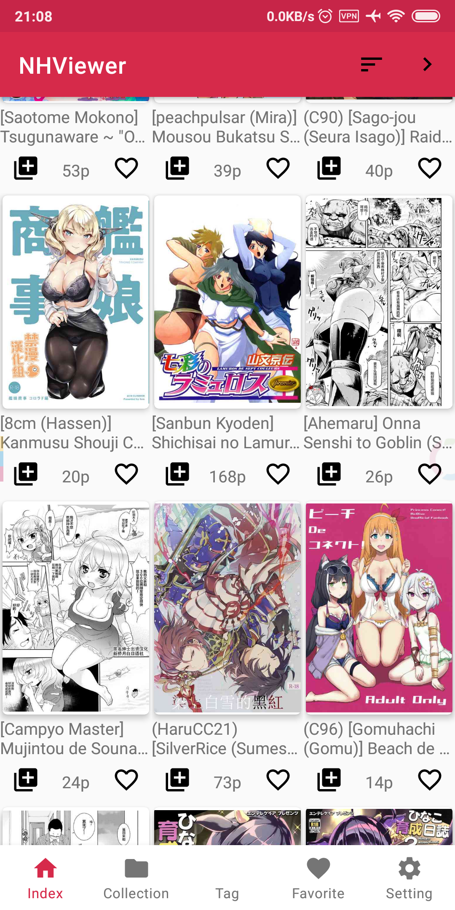
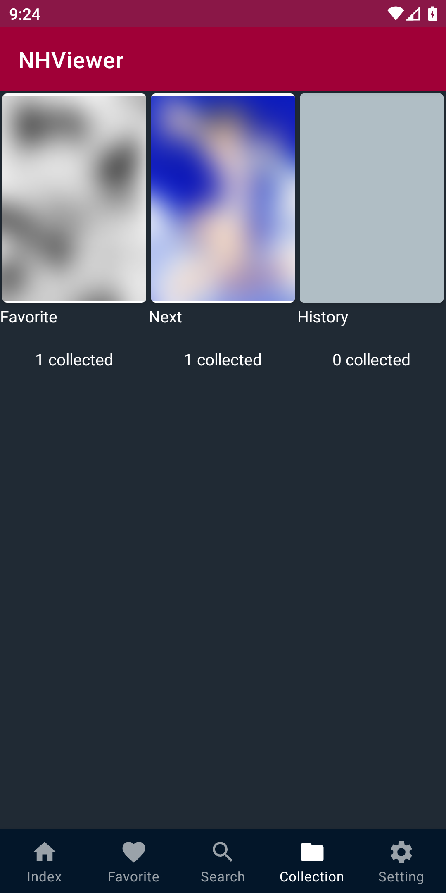
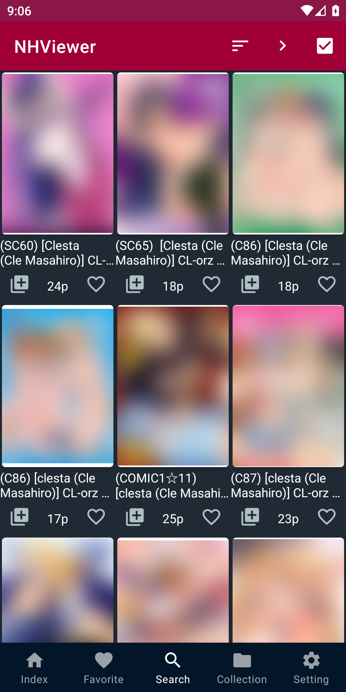
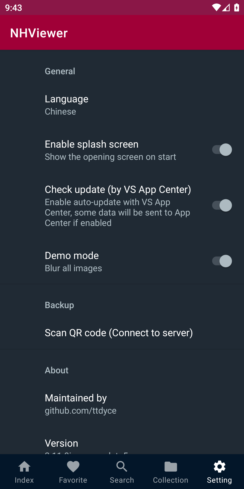

# NHViewer

Third-party application for browsing [nhentai.net](https://nhentai.net).

This application is developed to provide a better user experience for mobile device (Android) browsing the site and to build further functions on top of the site.

## Recent changes

### Icon & Splash screen

I would like to include NHentai’s icon and slogan in this project since it is an application about their site.  
I have sent them an email to ask for permission but there is still no reply yet.  
Please contact me if there are any issue, thanks. 

[Known bugs](https://github.com/ttdyce/NHentaiViewer/projects/1)😕

---

## Download

### Important note

- The nhviewer-x.x.x-signed.apk is recommended.
- **Star the repository** may speed up patch release... (¬‿¬ )

[Download](https://github.com/ttdyce/nhviewer/releases)

[NHV-Backup(Java)](https://github.com/ttdyce/NHV-Backup)

## Screenshots (In demo mode( •̀ ω •́ )y)

## Features

- Collection system
  - add / remove comic into collection list
  - add / remove collection list
  - backup collection content to desktop (Java program, pending to release)

- General
  - Vertical scrolling comic inner page
  - Scrollable comic list
  - Comic list sorting, by popularity/date uploaded
  - Search with custom tags and language
  - Page jumping

### Version 2 overview

- Refactor the UI ([Material Design](https://material.io/design/introduction/#principles)) and code architecture ([M-V-P](https://stackoverflow.com/questions/2056/what-are-mvp-and-mvc-and-what-is-the-difference))
- Retrieve data from [JSON API](https://github.com/NHMoeDev/NHentai-android/issues/27) (it's official? I guess)
- Migrate to AndroidX
- Use some of the [Android Jetpack Components](https://developer.android.com/jetpack)
- More features are in development

---

## Getting Started

The application is using the [JSON API](https://github.com/NHMoeDev/NHentai-android/issues/27) and parse the response data into Java class from version 2.  
For more information about coding, see [the wiki](https://github.com/ttdyce/NHentaiViewer/wiki) (which is not yet ready '_' please come back later).

## Deployment

Build and run the project inside Android Studio.

## Built With

- [Android Studio](https://developer.android.com/studio)
- An Android device (on Android 8.0 Oreo)

PS: Any version after Android Studio 3.5 should be fine

---

## Versioning

- [SemVer](http://semver.org/)

For the versions available, see the [tags on this repository](https://github.com/ttdyce/nhviewer/tags)

## Authors

- **ttdyce** - *Initial work and maintenance* - [github](https://github.com/ttdyce)

## License

This project is licensed under the MIT License - see the [LICENSE.md](LICENSE.md) file for details

## Acknowledgments

- Thanks for
  - Simplified Chinese translate from [History-exe](https://github.com/History-exe)
  - Traditional Chinese translate from [neslxzhen](https://github.com/neslxzhen)
  - Beautiful badges displaying Github data from [Shields.io](https://github.com/badges/shields)
  
- Inspired by
  - [nhentai.net](https://nhentai.net)
  - [NHBooks](https://github.com/NHMoeDev/NHentai-android)
  - [EhViewer](https://github.com/seven332/EhViewer)
  
- Dependencies
  - Image blur: [glide-transformations](https://github.com/wasabeef/glide-transformations) from [wasabeef](https://github.com/wasabeef)
  - [QRCodeReaderView](https://github.com/dlazaro66/QRCodeReaderView) from [dlazaro66](https://github.com/dlazaro66)
  - [Gson](https://github.com/google/gson)
  - [jsoup](https://jsoup.org/download)
  - [Glide](http://bumptech.github.io/glide/doc/download-setup.html)
  - [Volley](https://developer.android.com/training/volley)
  - [Travis CI](https://travis-ci.com/)
  - AndroidX libraries
